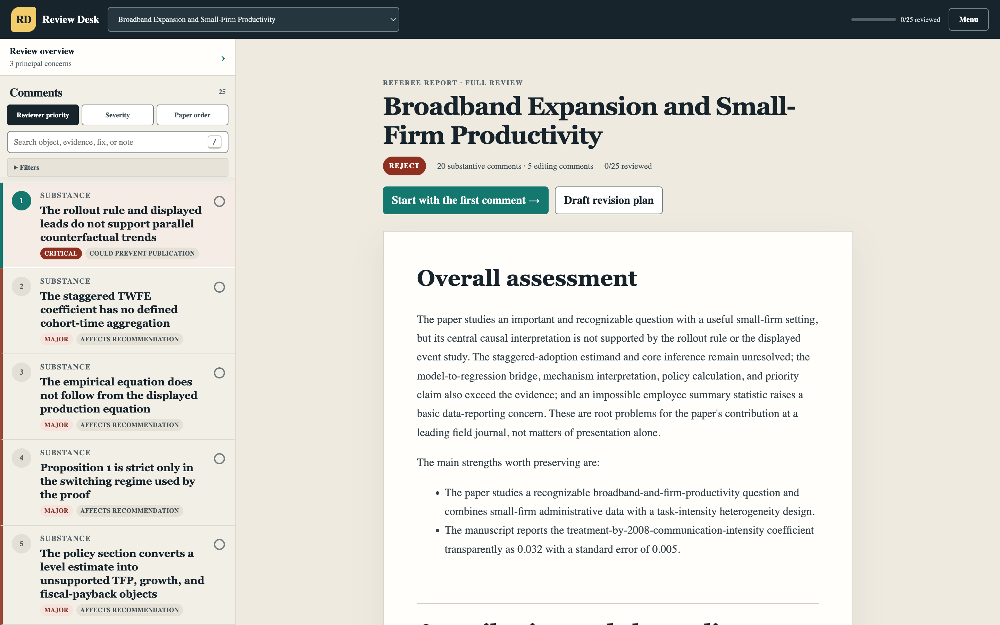
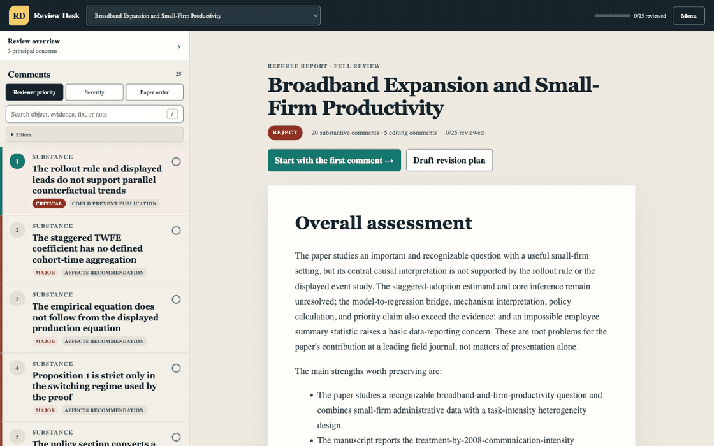
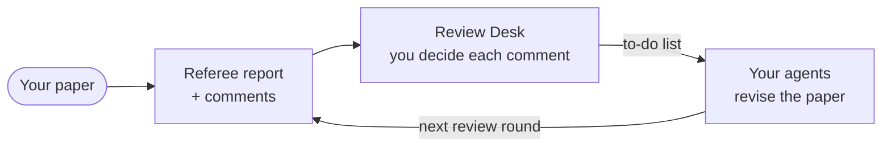
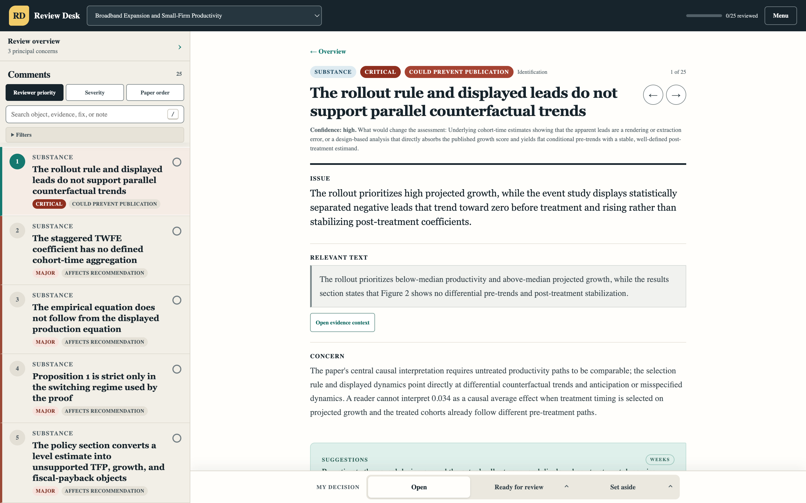

# Econ Paper Review Skill

**Get a tough, fair referee report on your economics paper — before a real referee sees it.**

[](LICENSE)
[](#install)
[](#install)

`econ-review` is an Agent Skill for Claude Code and Codex. It reads your paper the way a careful journal referee would: first it works out what you are claiming and how your evidence supports it, then it checks everything it can verify — identification, tables, proofs, numbers, references, writing — and gives you a referee report plus a step-by-step plan for fixing what it found. It never rewrites your paper. That part stays yours.

*Built for economics. Also works well for finance, accounting, political economy, and other social science papers that rest on data, causal inference, or formal models.*


*The optional Review Desk viewer opening a finished review — here, the [sample demonstration review](docs/sample-review/paper-review.pdf).*

## What you get

A finished review lands in a clean `review/` folder next to your paper:

- **`paper-review.pdf`** — the primary report: a professionally typeset, bookmarked PDF with the referee report, every detailed comment, editing comments, and the revision plan.
- **`reports/`** — the same reports as Markdown. The revision plan is a prioritized to-do list written to be handed straight to your agents.
- **`README.md`** — a one-page summary that tells you what to read first.
- **`supporting/`** — working files used by the Review Desk and later review rounds; most authors never open them.

Every comment quotes the relevant manuscript text — or, when the issue comes from a checked comparison or calculation, states that basis directly — then explains why it matters and what to do:

> ### Section 3: The global uniqueness claim fails at the equality boundary
>
> **Issue**: The proposition asserts strict uniqueness although the stated payoff permits a tie.
>
> **Relevant text**:
> > The equilibrium action is unique for every parameter value.
>
> **Concern**: At equality both actions maximize payoff, so the model supports a set-valued prediction. The proposition and comparative-static summary currently state a stronger global conclusion. No tie-breaking rule or boundary restriction appears in the supplied manuscript.
>
> **Suggestions**: Add a tie-breaking rule or state a set-valued equilibrium at the boundary. Align Proposition 1, its proof, and the comparative static.

*(From the bundled example. Full reviews keep every issue that survives verification — up to 100 substantive comments and 30 editing comments.)*

**[Read a full sample review (PDF)](docs/sample-review/paper-review.pdf)** — a complete 25-comment referee report on a [demonstration manuscript](docs/sample-review/demo-paper.pdf) written with intentional errors and reviewed cold with default settings.

## Install

Works on macOS, Windows, and Linux. Needs Python 3.10+ and [Poppler](https://poppler.freedesktop.org/) for PDF reading; no TeX, Pandoc, Node.js, or administrator access required.

Paste this into Claude Code or Codex and it will install itself:

```text
Help me install econ-review from https://github.com/hanlulong/econ-paper-review-skill
by following its docs/INSTALL.md. Run the dry run first, then the managed global setup
for both Claude Code and Codex with --with-review-desk. Use my existing GitHub login —
never ask me to paste a token — and do not install system packages, TeX, Pandoc, or
anything needing administrator access. When done, tell me the Review Desk command and
URL and remind me to reload my agent sessions.
```

The expanded, security-preserving prompt and project-local variants are in [docs/INSTALL.md](docs/INSTALL.md).

<details>
<summary>Manual installation</summary>

```bash
git clone https://github.com/hanlulong/econ-paper-review-skill.git
cd econ-paper-review-skill
python3 scripts/install_econ_review.py --dry-run --global --all --with-review-desk
python3 scripts/install_econ_review.py --global --all --with-review-desk
```

On native Windows, replace `python3` with the machine's working Python 3.10+ command (normally `python`) and use PowerShell path syntax; the optional `py` launcher is not required. If a compatible, working LuaLaTeX or Tectonic renderer is available, the report uses it; otherwise it uses the maintained built-in PDF renderer. Review Desk is prebuilt and needs no Node.js or npm. See [docs/INSTALL.md](docs/INSTALL.md) for skill-only, Claude-only, Codex-only, and project-local installs.

</details>

## Use it

Put your manuscript in your working directory — the PDF, plus the LaTeX or Markdown source if you have it — and ask:

```text
Use the econ-review skill in full mode to review this paper for a leading field journal.
Use the econ-review skill in quick mode and identify the three largest submission risks.
Use the econ-review skill to reconstruct the theory and empirical design before giving detailed comments.
```

`quick` gives you the biggest risks fast. `full` goes through every section, table, figure, equation, footnote, and appendix. When it finishes, open `review/paper-review.pdf`; use `review/README.md` for the file map and next-round workflow.

> [!IMPORTANT]
> **A full review takes 20 minutes to an hour**, depending on the paper's length and complexity. Let it run to the end — the verification passes that keep the comments trustworthy happen late in the run. `quick` mode finishes in a few minutes.

Then hand the to-do list to your agent — the revision plan is written for exactly that:

```text
Implement the P0 items in review/reports/revision-plan.md. Follow each instruction,
never invent results or citations, and report what changed where.
```

You decide, your agent revises, and the next review round checks every change.

## Why you can trust the comments

AI peer review usually fails in one of two ways: it makes things up, or it hands you a generic checklist. This skill was built specifically against both:

- **It reads your paper before it judges it.** It reconstructs the argument first and, where the supplied inputs permit, re-derives key equations and traces reported results. Comments come from understanding the paper, not from pattern-matching on keywords.
- **It checks comments against the source.** Quotations, equations, tables, and figures are checked against the supplied source or rendered PDF pages; reviewer-derived comparisons and calculations are labeled in plain language instead of presented as quotations.
- **It argues with itself before it argues with you.** Before a major comment reaches the report, the skill searches your paper and appendix for the strongest reply you could make. If your reply would win, the comment is deleted.
- **It checks your contribution against live literature.** Each novelty and citation claim becomes a targeted search; candidate papers are screened, authors and versions confirmed, and available full texts read before the review calls a citation missing or a contribution overstated. When the evidence is not decisive, it says so.
- **It is fair about data limits.** If your data can't do something, you say so in the paper, and your claims stay within those limits, that is not a flaw — and the review won't treat it as one.
- **It checks what fits your paper.** Difference-in-differences, IV, and RDD checks switch on only when your paper actually uses those designs. No demands for robustness checks that make no sense for your setting.

Every review also passes a set of automatic consistency checks before it is shown to you as finished.

## What it covers

Any kind of economics paper: empirical, experimental, descriptive, prediction and machine learning, structural, theoretical, macro, and mixed. The review adapts to how your paper actually works — its identification, inference, logic and proofs, magnitudes, framing of the contribution, terminology, exhibits, references, and reproducibility.

**Not just economics.** The checks target how a paper's evidence supports its claims — research design, causal inference, estimation and inference, formal models and proofs, tables and figures, reproducibility — so papers in finance, accounting, management, political science, public policy, and other empirical social sciences get the same depth of review. Journal norms and literature search are economics-first for now; anything field-specific the review can't assess is said plainly rather than guessed.

## What it does not do

It won't write your paper, estimate your acceptance odds, or invent citations. When it couldn't check something — a dataset it didn't have, a figure it couldn't read — it says so instead of pretending. And it doesn't claim to beat human referees: treat it as a tough extra reader before submission, not a replacement for peer review.

## The Review Desk (optional)



A local web viewer that turns a long review into a decided, trackable revision plan:

1. **Read the report first.** The Desk opens on the referee report, and every concern links straight to its detailed comment.
2. **Decide each comment.** Read it beside its manuscript evidence, add your instruction or disagreement, set your own P0/P1/P2 priority, and make one clear decision — keep it **Open**, mark it **Ready for review** after a change or reasoned response, or **Set aside**.
3. **Hand off the plan.** The Desk assembles your decisions into a prioritized to-do list and a structured response template for your agents.
4. **Close the loop.** The next review round checks every carried decision and runs a fresh full-paper sweep for new problems.





Everything stays on your machine — no uploads or accounts.

The recommended installer includes a verified, prebuilt copy with `--with-review-desk`; it prints one stable launch command and opens `http://127.0.0.1:48127/`. Launching it again reuses the verified local server; `--port PORT` selects another loopback port. Node.js is required only to modify or rebuild the viewer; see [review-viewer/README.md](review-viewer/README.md).

## Roadmap

- A measured benchmark with published precision and recall — before any comparative claims
- More design-specific checks (RCT, shift-share, synthetic control, structural, macro-VAR)
- Round-by-round usability improvements for author, implementation-agent, and re-review handoffs
- **A hosted version** — upload a PDF and receive the full review without a command line. Coming later.

## Related projects

- [econ-writing-skill](https://github.com/hanlulong/econ-writing-skill) — the writing-side sibling: this skill judges the paper, that one helps you write it
- [stata-mcp](https://github.com/hanlulong/stata-mcp) — run Stata from AI agents
- [awesome-ai-for-economists](https://github.com/hanlulong/awesome-ai-for-economists) — the broader toolbox

## Development and advanced installation

PDF backends, the output contract, the validation suite, and the release process are documented in [docs/DEVELOPMENT.md](docs/DEVELOPMENT.md).

## License

Econ Paper Review is source-available under the [PolyForm Noncommercial License 1.0.0](LICENSE). It is free to use, modify, and share for personal research, study, and other noncommercial purposes under that license. PolyForm expressly permits use by charitable organizations, educational institutions, public research organizations, public safety or health organizations, environmental protection organizations, and government institutions, regardless of their funding source or related funding obligations.

Use outside those permissions, including commercial use by other organizations, requires separate terms. For commercial licensing, contact [hanlulong@gmail.com](mailto:hanlulong@gmail.com). The copyright holder may also offer the software under other terms and reserves the right to operate paid hosted services, including a future premium service.

Unless a file or third-party notice says otherwise, the public license covers the repository's first-party source code, documentation, prompts, schemas, tests, designs, and bundled first-party materials. Third-party components remain under their respective licenses; see [`THIRD_PARTY_NOTICES.md`](THIRD_PARTY_NOTICES.md).

Contributions are welcome, and contributors retain ownership of their work. Before proposing a code or documentation change, read [`CONTRIBUTING.md`](CONTRIBUTING.md).

---

If this catches something a referee would have caught, star the repo so other economists find it — and if it gets something wrong, open an issue. Bad comments are bugs here, not opinions.
