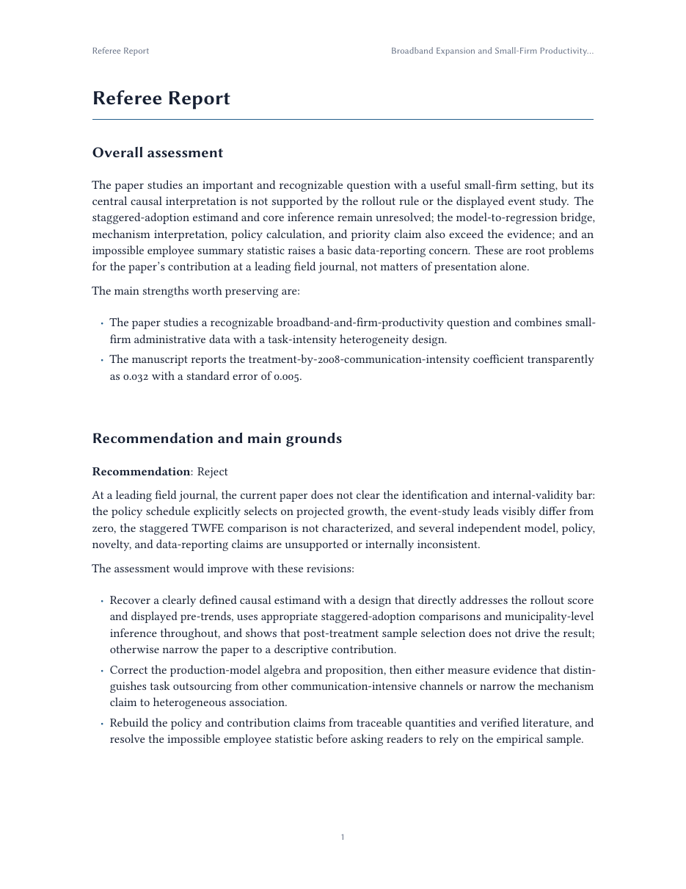
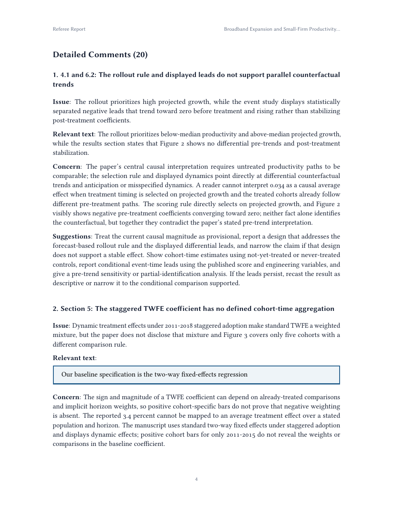
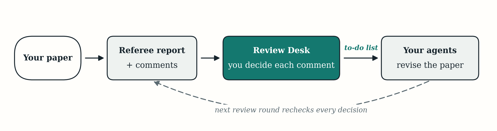

<!-- Sync note: this page mirrors README.md section for section; English is authoritative. Update both in the same commit. -->
# Econ Paper Review Skill（经济学论文 AI 审稿）

**在真正的审稿人看到之前，先给你的经济学论文一份严格而公允的审稿报告。**

[](LICENSE)
[](#安装)
[](#安装)
[](./README.md)
[](./README.zh-CN.md)

*源代码公开，学术、个人及其他非商业研究用途免费——详见[许可证](#许可证)。中英文如有出入，以[英文版](./README.md)为准。*

| 审稿报告 | 详细意见 |
|---|---|
|  |  |

*以上两页选自随仓库附带的[完整示例评审（PDF，25 条意见）](docs/sample-review/paper-review.pdf)——在一篇故意植入错误的[演示稿件](docs/sample-review/demo-paper.pdf)上以默认设置冷启动生成。*

`econ-review` 是一个面向 Claude Code 和 Codex 的 Agent Skill（智能体技能）。它像一位严谨的期刊审稿人那样阅读你的论文：先厘清你的核心主张以及证据如何支撑这些主张，再逐项核查一切可以验证的内容——识别策略、表格、证明、数值、参考文献、行文——然后给出一份审稿报告，外加一份逐步修改计划，告诉你如何解决发现的问题。它从不代你改写论文；那一部分始终由你完成。

*为经济学而生，也同样适用于金融、会计、政治经济学，以及其他依赖数据、因果推断或形式化模型的社会科学论文。*

## 你会得到什么

评审完成后，成果会整齐地存放在论文旁边的 `review/` 文件夹中：

- **`paper-review.pdf`** — 主报告：专业排版、带书签的 PDF，包含审稿报告、全部详细意见、编辑性意见和修改计划。
- **`reports/`** — 上述报告的 Markdown 版本。其中的修改计划是一份按优先级排序的待办清单，可直接交给你的 AI 智能体去执行。
- **`README.md`** — 一页纸摘要，告诉你应该先读什么。
- **`supporting/`** — 供 Review Desk 与后续评审轮次使用的工作文件；多数作者从不需要打开。

每条意见都会引用稿件中的相关原文——如果问题出自交叉核对或计算，则直接说明依据——然后解释它为何重要、应当如何处理。示例如下（审稿报告以英文生成）：

> ### Section 3: The global uniqueness claim fails at the equality boundary
>
> **Issue**: The proposition asserts strict uniqueness although the stated payoff permits a tie.
>
> **Relevant text**:
> > The equilibrium action is unique for every parameter value.
>
> **Concern**: At equality both actions maximize payoff, so the model supports a set-valued prediction. The proposition and comparative-static summary currently state a stronger global conclusion. No tie-breaking rule or boundary restriction appears in the supplied manuscript.
>
> **Suggestions**: Add a tie-breaking rule or state a set-valued equilibrium at the boundary. Align Proposition 1, its proof, and the comparative static.

*（选自随附示例。完整评审会保留每一条通过验证的问题——最多 100 条实质性意见和 30 条编辑性意见。）*

**[阅读完整示例评审（PDF）](docs/sample-review/paper-review.pdf)**——全部 25 条意见，而不只是上面的节选。

## 安装

支持 macOS、Windows 和 Linux。推荐以独立技能（standalone skill）方式安装，可在 Claude Code 中保留简短的 `/econ-review` 命令、在 Codex 中保留 `$econ-review` 调用方式。将以下内容原样粘贴到任一客户端即可（安装指令面向智能体，请保持英文原文）：

```text
Install or update Econ Review as a standalone skill for this client. Read and
follow the complete instructions at
https://github.com/hanlulong/econ-paper-review-skill/blob/main/INSTALL.md.
Handle installation, same-client migration, and verification yourself; keep
exactly one active copy for this client, do not change the other client, and do
not ask me to run commands. Report completion or the one genuine blocker.
```

以后需要更新时，粘贴同一段话即可；安装流程是幂等的，并会复用兼容的运行环境。需要本机已有 Python 3.10+（`venv` 与 pip 引导可用）。完整解析 PDF 稿件还需要 `PATH` 中有 [Poppler](https://poppler.freedesktop.org/)；不需要 TeX、Pandoc、Node.js，也不需要管理员权限。

<details>
<summary>从代码检出直接安装独立技能</summary>

```bash
git clone https://github.com/hanlulong/econ-paper-review-skill.git
cd econ-paper-review-skill
python3 scripts/install_econ_review.py --dry-run --global --all --with-review-desk
python3 scripts/install_econ_review.py --global --all --with-review-desk
```

只为单个客户端安装时，用 `--claude` 或 `--codex` 替换 `--all`。在原生 Windows 上，请在 PowerShell 中运行 `python scripts\install_econ_review.py --global --all --with-review-desk`。使用本机可用的 Python 3.10+ 命令即可，无需可选的 `py` 启动器。如果本机有可用且兼容的 LuaLaTeX 或 Tectonic 渲染器，报告会优先使用；否则使用持续维护的内置 PDF 渲染器。Review Desk 为预构建版本，不需要 Node.js 或 npm。迁移、更新、源码安装与项目级安装见 [INSTALL.md](INSTALL.md)。

</details>

<details>
<summary>可选：原生插件安装</summary>

偏好由插件市场统一管理更新的用户，仍可使用原生插件。请勿在同一客户端同时安装独立技能和原生插件。插件技能带命名空间：在 Claude Code 中使用 `/econ-review:econ-review`，在 Codex 中使用 `$econ-review:econ-review`。

Claude Code：

```text
/plugin marketplace add OpenEconAI/plugins
/plugin install econ-review@openeconai
```

Codex：

```bash
codex plugin marketplace add OpenEconAI/plugins
codex plugin add econ-review@openeconai
```

插件客户端没有可移植、可信的安装后自动步骤。直接安装插件后，请向智能体发送这一条消息：

```text
Run econ-review-setup now and finish its user-level setup with Review Desk.
```

插件本身已包含完整的评审工作流和安装工具。上述设置消息至多只会向 Econ Review 的私有环境下载声明过的核心 Python 包；绝不会上传稿件，也不会静默安装系统软件。迁移、卸载与故障排查见[安装指南](INSTALL.md)。

切勿将令牌（token）或包索引凭据粘贴到对话或命令行中。

</details>

## 使用

以普通的论文评审请求即可自动触发本技能。把稿件放进工作目录——PDF，如有 LaTeX 或 Markdown 源文件一并放入——然后提出请求（中文提问同样有效；示例为英文原文）：

```text
Review this paper in full mode for a leading field journal.
Review this paper in quick mode and identify the three largest submission risks.
Reconstruct the theory and empirical design before giving detailed comments.
```

要显式调用独立技能，在 Claude Code 中使用 `/econ-review`，在 Codex 中使用 `$econ-review`。

`quick` 模式快速给出最大的风险点；`full` 模式逐一检查每个章节、表格、图形、公式、脚注和附录。完成后打开 `review/paper-review.pdf`；`review/README.md` 提供文件导览和下一轮评审的工作流程。

> [!IMPORTANT]
> **完整评审通常需要 30 分钟或更久**；篇幅长、技术性强、需要联网核对文献的论文可能明显更久。请让它运行到底——保证意见可信的验证环节发生在运行后期。需要快速把握最大风险时，请使用 `quick` 模式。

然后把待办清单交给你的智能体——修改计划正是为此而写：

```text
Implement the P0 items in review/reports/revision-plan.md. Follow each instruction,
never invent results or citations, and report what changed where.
```

你来决策，智能体来修改，下一轮评审会复核每一处改动。

## 为什么这些意见值得信任

AI 同行评审通常败在两点之一：要么凭空捏造，要么给你一份放之四海而皆准的检查清单。本技能正是针对这两点而构建：

- **先读懂，再评判。** 它先重构论文的论证结构，并在所给材料允许的范围内重新推导关键公式、追踪报告的结果。意见来自对论文的理解，而不是对关键词的模式匹配。
- **每条意见对照原文核验。** 引文、公式、表格和图形都会与所提供的源文件或渲染后的 PDF 页面核对；由评审方自行推算的比较和计算会用平实语言注明，而不会伪装成引文。
- **先和自己辩论，再和你辩论。** 重要意见进入报告之前，技能会在你的正文和附录中搜寻你可能给出的最强回应。如果你的回应会赢，这条意见就会被删除。
- **对照最新文献核查贡献声明。** 每一项创新性与引用声明都会转化为定向检索；候选文献经过筛选、作者与版本确认、可获取的全文阅读之后，评审才会断言"漏引"或"贡献夸大"。证据不足以下定论时，它会如实说明。

此外，每份评审在标记完成之前，还要通过一组自动一致性检查。

## 覆盖范围

任何类型的经济学论文：实证、实验、描述性、预测与机器学习、结构式、理论、宏观以及混合型。评审会适配论文的实际路数——识别策略、统计推断、逻辑与证明、量级解读、贡献定位、术语、图表、参考文献和可复现性。

**不止经济学。** 这些核查针对的是"证据如何支撑论断"——研究设计、因果推断、估计与推断、形式化模型与证明、表格与图形、可复现性——因此金融、会计、管理学、政治学、公共政策及其他实证社会科学的论文也能获得同样深度的评审。期刊规范与文献检索目前以经济学为先；无法评估的领域特有问题会明确说明，而不是妄加猜测。

## 它不做什么

它不会代写论文、不会估计录用概率、不会编造引文。遇到无法核实的内容——拿不到的数据集、读不了的图——它会如实说明，而不是装作已经核实。它也不声称胜过人类审稿人：请把它当作投稿前多出的一位严格读者，而不是同行评审的替代品。

## 与 Refine.ink 及其他 AI 审稿服务的比较

[Refine](https://www.refine.ink/) 让经济学界认识到"AI 投稿前评审"值得认真对待，这一点值得肯定。两种工具做的是同一件事，但取舍不同，有些作者会两者都用：

| | econ-review（本技能） | Refine.ink |
|---|---|---|
| **费用** | 免费、代码公开——使用你自己的 Claude Code 或 Codex 订阅 | 每次评审 $49.99（套餐价每次 $30–40，2026 年 7 月价格） |
| **多轮迭代** | 为多轮修改而设计：评审 → 在 Review Desk 中逐条决策 → 智能体修改 → 下一轮复核每项决定 | 每次评审单独付费 |
| **交付物** | 审稿报告 + 经验证的详细意见 + 编辑性意见 + 面向智能体的修改计划 | 审稿式实质性意见 |
| **论文去向** | 在你自己的智能体内运行；不向我们上传任何内容，适用你现有 AI 服务商的条款 | 上传至其服务（SOC 2 / ISO 27001 认证，不用论文训练模型） |
| **开放程度** | 全部提示词、核查规则与评分标准都在本仓库——可阅读、可派生、可按领域调校 | 闭源流水线 |
| **上手门槛** | 需要 Claude Code 或 Codex | 无——上传 PDF 即可 |

其他托管审稿服务——referee3.app、斯坦福的 PaperReview.ai——在这些取舍上与 Refine 属于同一侧。

如果命令行不在你的选项之内，托管服务是当下更实际的选择——或者等待本技能的[托管版本](#路线图)。在给出任何质量对比结论之前，我们会先发布带查准率与查全率的测评基准——这一承诺已列入路线图。

## Review Desk（可选）

一个本地网页查看器，把一份长评审变成一份逐条决策、可跟踪的修改计划：



1. **先读报告。** Review Desk 默认打开审稿报告，每个关注点都直接链接到对应的详细意见。
2. **逐条决策。** 对照稿件证据阅读每条意见，写下你的处理指示或反驳，设定你自己的 P0/P1/P2 优先级，并做出一个明确决定——保持**待处理（Open）**、修改或有理有据回应后标记**待复核（Ready for review）**，或**搁置（Set aside）**。
3. **移交计划。** Review Desk 把你的决定汇编成按优先级排序的待办清单和结构化回应模板，交给你的智能体。
4. **闭环复核。** 下一轮评审会核查每项已作的决定，并对全文重新扫描新问题。


一切都在你的电脑上完成——无上传、无账号。

推荐安装方式（`--with-review-desk`）附带经过校验的预构建版本；它会输出一条固定的启动命令并打开 `http://127.0.0.1:48127/`。再次启动会复用已校验的本地服务；`--port PORT` 可换用其他回环端口。只有修改或重新构建查看器才需要 Node.js；见 [review-viewer/README.md](review-viewer/README.md)。

## 路线图

- 带公开查准率与查全率的测评基准——先于任何对比性结论
- 更多针对具体研究设计的核查（RCT、shift-share、合成控制、结构式、宏观 VAR）
- 面向"作者—执行智能体—复审"多轮交接的易用性改进
- **托管版本**——上传 PDF 即可获得完整评审，无需命令行。后续推出。

## 相关项目

- [econ-writing-skill](https://github.com/hanlulong/econ-writing-skill) — 写作侧的姊妹技能：本技能评判论文，它帮你写好论文
- [econ-slides-skill](https://github.com/hanlulong/econ-slides-skill) — 修改完成之后：把论文变成一套专业 Beamer 演讲及配套讲稿
- [stata-mcp](https://github.com/hanlulong/stata-mcp) — 让 AI 智能体运行 Stata
- [awesome-ai-for-economists](https://github.com/hanlulong/awesome-ai-for-economists) — 更全面的工具索引

## 开发与高级安装

PDF 渲染后端、输出契约、验证套件与发布流程见 [docs/DEVELOPMENT.md](docs/DEVELOPMENT.md)。

## 许可证

Econ Paper Review 以源代码公开的 [PolyForm Noncommercial License 1.0.0](LICENSE) 发布：个人研究、学习及其他非商业用途可自由使用、修改和分享。PolyForm 明确允许慈善组织、教育机构、公共研究机构、公共安全或卫生机构、环境保护组织及政府机构使用，与其经费来源或相关经费义务无关。

超出上述许可的使用（包括其他组织的商业使用）需另行授权。商业授权请联系 [hanlulong@gmail.com](mailto:hanlulong@gmail.com)。版权持有人也可能以其他条款提供本软件，并保留运营付费托管服务（包括未来的高级版服务）的权利。

除非单个文件或第三方声明另有说明，公共许可证覆盖本仓库的第一方源代码、文档、提示词、模式定义、测试、设计及随附的第一方材料。第三方组件仍适用其各自许可证；见 [`THIRD_PARTY_NOTICES.md`](THIRD_PARTY_NOTICES.md)。

欢迎贡献，贡献者保留其作品的所有权。提交代码或文档改动之前，请先阅读 [`CONTRIBUTING.md`](CONTRIBUTING.md)。

---

如果它抓住了一个本会被审稿人抓住的问题，请为仓库点一颗星，让更多经济学者找到它；如果它说错了什么，请开一个 issue。在这里，糟糕的意见是 bug，不是观点分歧。
